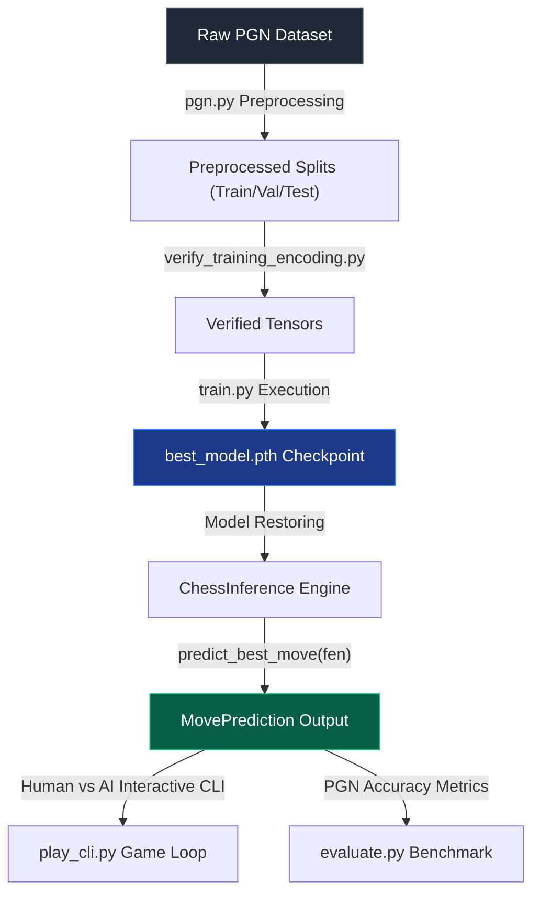
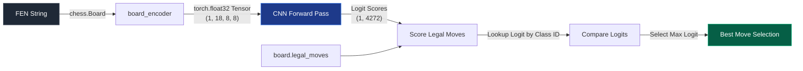
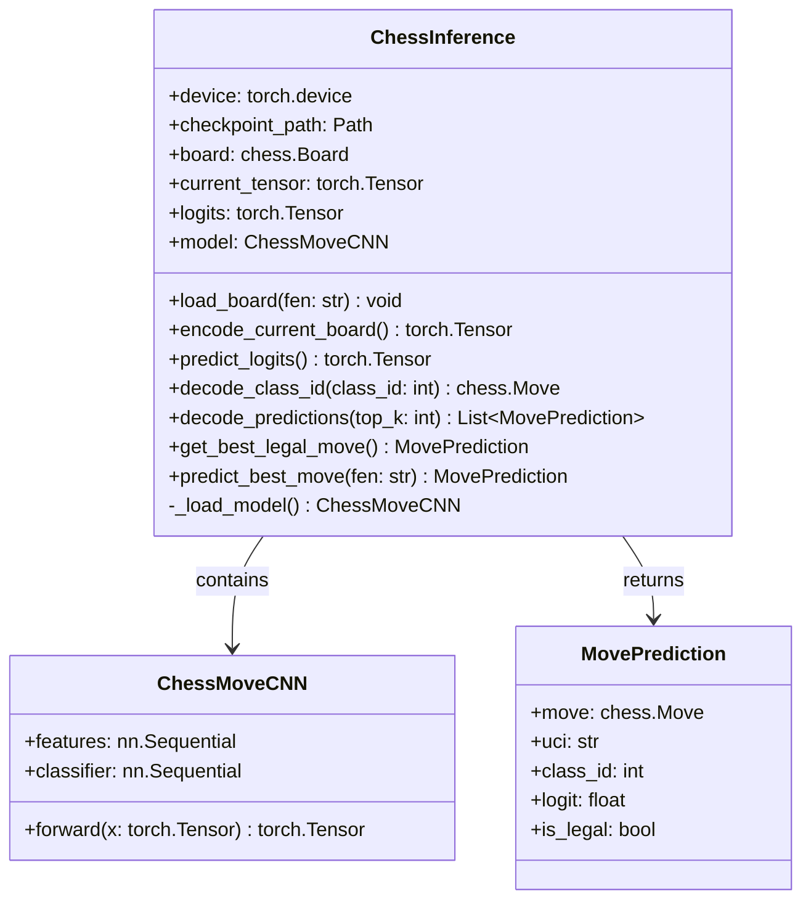

# Supervised Chess AI — Software Architecture Documentation

This document describes the internal software architecture, module roles, class relationships, and design decisions of the **Supervised Chess AI** project.

---

## 1. High-Level Architecture

The project is structured into three main stages: Dataset Processing, Offline Supervised Training, and Real-Time Inference:

---

## 2. Module Descriptions

### Core Preprocessing & Encoding Modules
- **`board_encoder.py`**: Encodes a `chess.Board` position into an `(18, 8, 8)` NumPy array representation representing pieces, active turn, castling rights, and en-passant states.
- **`move_encoder.py`**: Houses the logic to encode `chess.Move` objects into classification indices `(0–4271)` and decode indices back to `chess.Move` objects.
- **`chess_model.py`**: Declares the `ChessMoveCNN` neural network architecture, featuring multiple convolutional layers for spatial feature extraction followed by a linear classification head.

### Preprocessing & Validation Tools
- **`data/pgn.py`**: Utility to filter raw PGN files for 20+ ply games, shuffle datasets, and split them into Training, Validation, and Test sets.
- **`verify_training_encoding.py`**: Verification script confirming that all positions in the splits successfully round-trip encode/decode without errors.
- **`extract_training_samples.py`**: Analyzes game datasets and outputs split size plies counts.

### Runtime & Application Modules
- **`src/inference.py`**: The core runtime engine that integrates model loading, CUDA/CPU detection, positional encoding, forward pass logits caching, and move selection.
- **`src/play_cli.py`**: An interactive console game loop permitting human players to play against the CNN-based AI using standard UCI notation.
- **`src/evaluate.py`**: Benchmark utility that streams games from PGN files, replays moves, and evaluates accuracy (Top-1, Top-3, Top-5, Top-10) and execution speed.

---

## 3. Data Flow

The runtime inference pipeline processes board inputs as follows:

---

## 4. Class Diagram

The runtime classes are structured to maximize modularity and maintain clear interfaces:

---

## 5. Folder Responsibilities

- **`Main/`**: Project root folder containing all configurations, datasets, and scripts.
- **`Main/data/`**: Hosts all raw PGN assets and processed splits:
  - **`Main/data/splits/`**: Contains train, validation, and test subsets.
- **`Main/models/`**: Stores weights files, including the validated production checkpoint `best_model.pth`.
- **`Main/src/`**: Houses production-ready execution engines (`inference.py`, `play_cli.py`, `evaluate.py`).
- **`Main/tests/`**: Contains unit testing verification modules.
- **`Main/docs/`**: Stores markdown technical architecture documentations (this folder).

---

## 6. Design Decisions

### Why Reuse the Existing Encoder?
Using identical encoding logic (`board_encoder` and `move_encoder`) during training and inference eliminates **feature skew**. Skewed board plane values or incorrect mapping of promotion indices would lead to incorrect classification lookups, degrading play strength.

### Why Cache Logits?
Performing deep neural network inference is computationally expensive. By running a single forward pass through the CNN per turn and caching the resulting `(1, 4272)` logit vector, we can score all legal moves using memory lookups. This reduces inference latency to **~1.30 ms** per position.

### Why Enforce Legal Move Filtering?
Supervised learning models predict moves based on probabilistically learned training patterns. Because the model outputs predictions without a strict rule engine, it may predict illegal moves (e.g. attempting to move through check or passing through blocked squares). Evaluating only `board.legal_moves` guarantees that the engine is 100% compliant with FIDE rules.

### Why Use `MovePrediction` Dataclass?
Standardizing return values using a typed dataclass replaces messy tuples. Dataclasses improve readability, enable static analysis type checks, and decouple the application boundary (like GUI or API servers) from python-chess board representations.

### Why Develop a Modular API?
Decoupling board loading (`load_board`), tensor encoding (`encode_current_board`), and selection (`get_best_legal_move`) makes the code reusable. It allows the same engine instance to power a CLI loop, a PGN evaluation script, a GUI app, or a web API without code duplication.

---

## 7. Future Extension Points

- **Graphical User Interface (GUI)**: The modular `predict_best_move()` API can be integrated into a Pygame front-end or an Electron-based visual application.
- **REST API Server**: The class interface is stateless between predictions. It can be wrapped in a FastAPI or Flask endpoint to serve moves to web frontends.
- **Reinforcement Learning (RL)**: Self-play simulations can be implemented by restoring `ChessInference` inside an RL loop to refine weights through policy gradient algorithms.
- **Search Algorithms**: The raw policy logits predicted by the CNN can be combined with Monte Carlo Tree Search (MCTS) or Minimax with Alpha-Beta pruning, using the network outputs to prune search branches and guide deep lookaheads.
