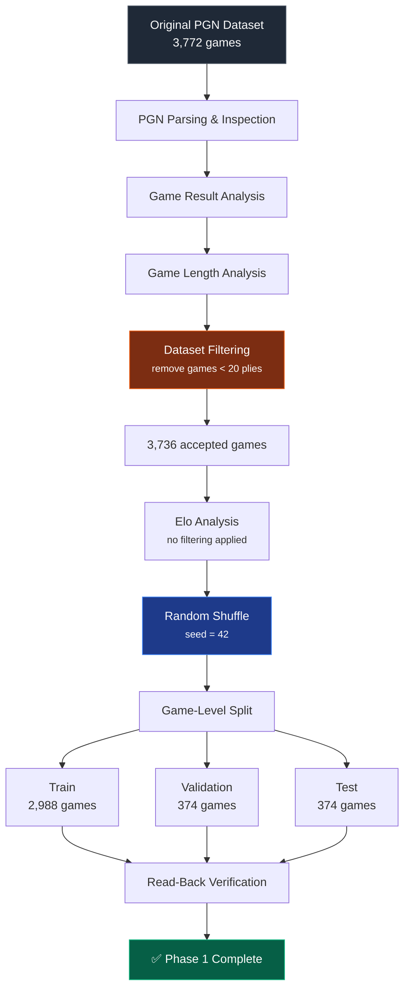

<div align="center">

# ♟️ Supervised Chess AI — Dataset Pipeline

### Phase 1 · Dataset Preparation

*A clean, reproducible pipeline for turning raw PGN archives into training-ready chess data.*


</div>

---

##  Table of Contents

1. [Overview](#-overview)
2. [Pipeline at a Glance](#-pipeline-at-a-glance)
3. [Dataset Inspection](#-1-initial-dataset-inspection)
4. [Game Result Analysis](#-2-game-result-analysis)
5. [Game Length Analysis](#️-3-game-length-analysis)
6. [Dataset Filtering](#-4-dataset-filtering)
7. [Player Elo Analysis](#-5-player-elo-analysis)
8. [Dataset Shuffling](#-6-dataset-shuffling)
9. [Train / Validation / Test Split](#-7-train--validation--test-split)
10. [Split Isolation Verification](#-8-split-isolation-verification)
11. [Saving the Dataset](#-9-saving-the-dataset-splits)
12. [Saved Dataset Verification](#-10-saved-dataset-verification)
13. [Regression Testing](#-11-regression-testing)
14. [Final Summary](#-phase-1-final-summary)

---

##  Overview

Phase 1 focuses on preparing a clean, reliable, and reproducible **chess game dataset** for training a supervised-learning chess AI.

The source dataset is a **PGN (Portable Game Notation)** file containing historical chess games. Before any of it touches a model, every game is **inspected → analyzed → filtered → shuffled → split → saved → verified**, with automated tests guarding the whole process.

> **What's a "ply"?** One move by one player. `1. e4 e5` = 2 plies (one white, one black).

---

##  Pipeline at a Glance



---

##  1. Initial Dataset Inspection

The PGN dataset was parsed with the `python-chess` library to confirm that games, player metadata, results, and move sequences could all be extracted correctly.

| Metric | Result |
|---|---:|
| Total games | **3,772** |
| Shortest game | 0 plies |
| Longest game | 332 plies |
| Average game length | 84.50 plies |
| Games with fewer than 20 plies | 36 |

---

##  2. Game Result Analysis

Every result header across all 3,772 games was checked for completeness.

| Game Result | Games | Share |
|---|---:|---:|
| White wins (`1-0`) | 1,235 | 32.7% |
| Black wins (`0-1`) | 771 | 20.4% |
| Draws (`1/2-1/2`) | 1,766 | 46.8% |
| Unknown / Other | 0 | 0.0% |
| **Total** | **3,772** | **100%** |

✅ All games contained valid result information — no cleanup needed here.

---

##  3. Game Length Analysis

Very short games carry little useful board-position/move-pair signal for supervised learning, so game lengths were bucketed and inspected.

| Game Length | Number of Games |
|---|---:|
| 0 plies | 14 |
| 1–5 plies | 3 |
| 6–10 plies | 0 |
| 11–19 plies | 19 |
| 20+ plies | 3,736 |
| **Total** | **3,772** |

- **14 zero-ply games** → no playable moves, zero training samples possible.
- **36 games in total** fell below the 20-ply threshold.

---

##  4. Dataset Filtering

**Rule applied:** only games with **20 or more plies** are accepted into the ML dataset.

| Dataset Status | Games |
|---|---:|
| ✅ Accepted (20+ plies) | 3,736 |
| ❌ Rejected (< 20 plies) | 36 |
| Original | 3,772 |

> Rejected games are **not deleted** from the raw PGN — they're simply excluded during dataset preparation, keeping the source archive intact.

---

##  5. Player Elo Analysis

Player ratings were reviewed to understand the playing strength represented in the data.

| Elo Metric | Result |
|---|---:|
| Games with Elo for both players | 3,700 |
| Games missing Elo (one/both) | 72 |
| Minimum available Elo | 1,382 |
| Maximum available Elo | 2,865 |
| Average available Elo | 2,626.65 |

The high average Elo confirms this is largely **high-level chess**. No Elo-based filtering was applied — missing Elo doesn't imply unusable moves, so those games were retained.

---

##  6. Dataset Shuffling

After filtering, **3,736 accepted games** remained and were randomly shuffled prior to splitting.

```
Random seed = 42
```

A fixed seed guarantees the split is **fully reproducible** — rerunning the pipeline on the same data yields identical train/validation/test assignments every time.

---

##  7. Train / Validation / Test Split

An **80 / 10 / 10** split was applied **at the game level** (not per-position), so every position from a given game stays together in one bucket.

| Dataset | Games | Purpose |
|---|---:|---|
| 🟩 Training | 2,988 | Train the neural network |
| 🟨 Validation | 374 | Monitor performance during development |
| 🟦 Testing | 374 | Final evaluation on unseen games |
| **Total** | **3,736** | |

> **Why split by game, not by position?** A single game contains many highly correlated consecutive positions. Splitting positions randomly would leak information between train and test sets, inflating evaluation scores artificially.

---

##  8. Split Isolation Verification

| Check | Result |
|---|---|
| Training ↔ Validation overlap | None |
| Training ↔ Test overlap | None |
| Validation ↔ Test overlap | None |
| **Overall overlap check** | **✅ Passed** |

Confirms the test set is genuinely unseen during training.

---

##  9. Saving the Dataset Splits

Each split was saved as an independent PGN file:

```text
data/
├── original_dataset.pgn
│
└── splits/
    ├── train.pgn
    ├── validation.pgn
    └── test.pgn
```

| File | Games |
|---|---:|
| `train.pgn` | 2,988 |
| `validation.pgn` | 374 |
| `test.pgn` | 374 |

Full PGN fidelity is preserved — headers and move sequences included — for every game.

---

##  10. Saved Dataset Verification

Each saved file was reopened and re-parsed to confirm nothing was lost, duplicated, or corrupted during the save.

| PGN File | Expected | Read Back | Verification |
|---|---:|---:|---|
| `train.pgn` | 2,988 | 2,988 | ✅ Passed |
| `validation.pgn` | 374 | 374 | ✅ Passed |
| `test.pgn` | 374 | 374 | ✅ Passed |

---

##  11. Regression Testing

Automated tests guard the pipeline against regressions in future changes, covering:

- Correct dataset filtering
- Correct train / validation / test sizes
- No overlap between splits
- Correct PGN saving
- Correct PGN read-back

```text
3 passed
```

---

## ✅ Phase 1 Final Summary

<details>
<summary><strong>Click to expand full checklist</strong></summary>

- [x] Parsed successfully
- [x] Inspected for game results
- [x] Analyzed for game lengths
- [x] Analyzed for player Elo
- [x] Filtered to remove games with fewer than 20 plies
- [x] Randomly shuffled using a reproducible seed (`42`)
- [x] Split at the game level (80/10/10)
- [x] Checked for overlap between splits
- [x] Saved into separate PGN files
- [x] Read back and verified
- [x] Protected by regression tests

</details>


---


</div>
