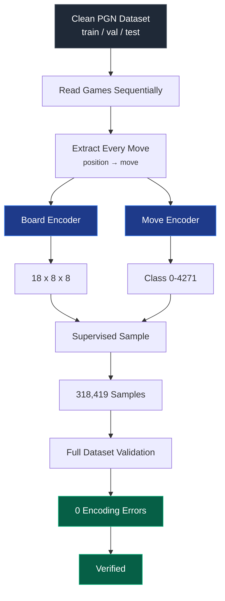
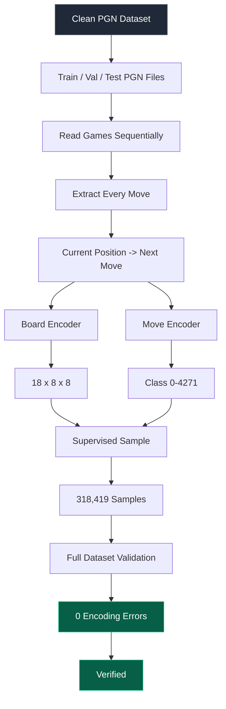

<div align="center">

# Supervised Chess AI — Dataset Pipeline

### Phase 2 · Supervised Learning Sample Generation & Encoding

*Turning verified PGN datasets into numerical board and move representations for training.*


</div>

---

## Table of Contents

1. [Overview](#overview)
2. [Pipeline at a Glance](#pipeline-at-a-glance)
3. [Position → Move Sample Extraction](#1-position--move-sample-extraction)
4. [Full Dataset Sample Count](#2-full-dataset-sample-count)
5. [Board Encoding](#3-board-encoding)
6. [Piece-Position Planes](#4-piece-position-planes)
7. [Piece-Plane Verification](#5-piece-plane-verification)
8. [Side-to-Move Encoding](#6-side-to-move-encoding)
9. [Castling-Rights Encoding](#7-castling-rights-encoding)
10. [En-Passant Encoding](#8-en-passant-encoding)
11. [Final Board Representation](#9-final-board-representation)
12. [Initial Move Encoding](#10-initial-move-encoding)
13. [Promotion Limitation Discovery](#11-promotion-limitation-discovery)
14. [Promotion Analysis](#12-promotion-analysis)
15. [Initial Promotion-Aware Move Encoder](#13-initial-promotion-aware-move-encoder)
16. [Promotion-Class Optimization](#14-promotion-class-optimization)
17. [Final Optimized Move Encoding](#15-final-optimized-move-encoding)
18. [Move Encoder Regression Testing](#16-move-encoder-regression-testing)
19. [Board + Move Encoder Integration Test](#17-board--move-encoder-integration-test)
20. [Full Dataset Encoding Verification](#18-full-dataset-encoding-verification)
21. [Full Dataset Verification Results](#19-full-dataset-verification-results)
22. [File Overview](#20-phase-2-file-overview)
23. [Final ML Representation](#21-final-machine-learning-representation)
24. [Final Statistics](#22-phase-2-final-statistics)
25. [Pipeline Summary](#23-phase-2-pipeline-summary)


---

## Overview

Phase 2 transforms the cleaned and split PGN chess dataset from Phase 1 into a numerical representation suitable for supervised machine learning.

Phase 1 produced three verified PGN datasets:

| Dataset | Games |
|---|---:|
| Training | 2,988 |
| Validation | 374 |
| Test | 374 |
| **Total** | **3,736** |

Phase 2 converts these games, conceptually, into supervised-learning examples:

```text
Current Chess Position → Next Move
```

Two encoding systems were built and verified:

1. **Board Encoder** — converts a chess position into an `(18, 8, 8)` numerical representation.
2. **Move Encoder** — converts the target move into one of `4,272` unique move classes.

```text
PGN Game
   │
   ▼
Current Board Position
   │
   ├───────────────► Board Encoder ──► (18, 8, 8)
   │
   ▼
Next Move
   │
   └───────────────► Move Encoder ──► Class 0–4271
```

This provides the input/target representation required for the neural network in Phase 3.

---

## Pipeline at a Glance



---

## 1. Position → Move Sample Extraction

The first objective was to verify that individual games could be transformed into supervised-learning samples.

A new script, `extract_training_samples.py`, initially read only the first game from `data/splits/train.pgn`.

For every move in the game, the script captured:

```text
Board position BEFORE the move → Move played from that position
```

The board position was represented using **FEN** (Forsyth–Edwards Notation), and the target move using **UCI** (Universal Chess Interface) notation.

Conceptually, a game such as:

```text
1. e4 e5
2. Nf3 Nc6
```

produces:

```text
Starting Position   → e2e4
After e2e4          → e7e5
After e7e5          → g1f3
After g1f3          → b8c6
```

Every individual ply generates one supervised-learning sample. The extraction pipeline was successfully verified on the first training game.

---

## 2. Full Dataset Sample Count

`extract_training_samples.py` was extended to process all games from `train.pgn`, `validation.pgn`, and `test.pgn`, counting every move as one sample.

| Dataset | Games | Position → Move Samples |
|---|---:|---:|
| Training | 2,988 | 254,890 |
| Validation | 374 | 32,085 |
| Test | 374 | 31,444 |
| **Total** | **3,736** | **318,419** |

The cleaned dataset therefore produces **318,419** supervised-learning samples, with **254,890** from the training split alone.

Samples were counted sequentially without storing the full encoded dataset in memory, keeping memory usage low and appropriate for the project's hardware constraints.

---

## 3. Board Encoding

A neural network cannot directly process a `python-chess` `Board` object or FEN string, so a numerical board representation was developed in `board_encoder.py`, built incrementally and tested after each addition.

The final board representation has shape:

```text
(18, 8, 8)
```

Every chess position is represented using **18 separate 8×8 planes**.

---

## 4. Piece-Position Planes

The initial encoder contained 12 binary planes covering every piece type and color combination.

| Plane | Representation |
|---:|---|
| 0 | White Pawn |
| 1 | White Knight |
| 2 | White Bishop |
| 3 | White Rook |
| 4 | White Queen |
| 5 | White King |
| 6 | Black Pawn |
| 7 | Black Knight |
| 8 | Black Bishop |
| 9 | Black Rook |
| 10 | Black Queen |
| 11 | Black King |

Each plane is `8 × 8`, where a square holds `1` if the corresponding piece is present and `0` otherwise. The initial representation was therefore `12 × 8 × 8`.

---

## 5. Piece-Plane Verification

Tested against the standard starting position, expecting shape `(12, 8, 8)` with **32** total active values — matching the 32 pieces on the board at game start.

| Piece Plane | Active Squares |
|---|---:|
| White Pawn | 8 |
| White Knight | 2 |
| White Bishop | 2 |
| White Rook | 2 |
| White Queen | 1 |
| White King | 1 |
| Black Pawn | 8 |
| Black Knight | 2 |
| Black Bishop | 2 |
| Black Rook | 2 |
| Black Queen | 1 |
| Black King | 1 |

All piece-plane counts matched the expected starting position.

---

## 6. Side-to-Move Encoding

Piece positions alone can't fully describe a position — two identical arrangements can represent different game states depending on whose turn it is. A 13th plane was added:

```text
Plane 12 → Side to Move
```

Rule: **White to move → plane filled with 1**, **Black to move → plane filled with 0**. Board shape became `(13, 8, 8)`.

Verified on the starting position:

- Before White moved: side-to-move unique values `[1]`
- After one legal White move: side-to-move unique values `[0]`

The transition check passed.

---

## 7. Castling-Rights Encoding

Castling rights can't always be inferred from piece positions alone — a king and rook may sit on their original squares even if the king has already moved and lost castling rights. Four planes were added:

| Plane | State |
|---:|---|
| 13 | White Kingside Castling |
| 14 | White Queenside Castling |
| 15 | Black Kingside Castling |
| 16 | Black Queenside Castling |

Each plane is filled entirely with `1` (right available) or `0` (right unavailable). Board shape became `(17, 8, 8)`.

**Starting position:** all four rights `[1]`.
**No-castling position:** all four planes correctly `[0]`.

Castling-right encoding verified successfully.

---

## 8. En-Passant Encoding

En-passant availability is another temporary state property that can't be read from static piece positions alone. One further plane was added:

```text
Plane 17 → En-Passant Target Square
```

Rule: no target → entire plane `0`; if a target exists, that square is `1` and all others `0`. This produced the final shape `(18, 8, 8)`.

**Starting position:** 0 active en-passant squares.
**After `e2e4`:** 1 active square, target `e3`.

En-passant encoding verified successfully.

---

## 9. Final Board Representation

| Information | Planes |
|---|---:|
| White pieces | 6 |
| Black pieces | 6 |
| Side to move | 1 |
| Castling rights | 4 |
| En-passant target | 1 |
| **Total** | **18** |

```text
Board Input Shape = (18, 8, 8)
```

```text
Chess Position → board_encoder.py → 18 × 8 × 8 Numerical Representation → Neural Network
```

---

## 10. Initial Move Encoding

Development moved to `move_encoder.py`. The initial representation used:

```text
from_square × 64 + to_square
```

Since a board has 64 squares: `64 × 64 = 4,096`, giving a base move-class range of `0–4095`.

Tested on `e2e4`, `g1f3`, `e7e5`, `b8c6` via encode → integer class → decode. All round-trip tests returned `True`.

---

## 11. Promotion Limitation Discovery

The basic 4,096-class scheme has a key limitation. Consider:

```text
e7e8q   e7e8r   e7e8b   e7e8n
```

All four share `from = e7`, `to = e8` — differing only in the promotion piece. `from_square × 64 + to_square` cannot distinguish between them. Before modifying the encoder, the dataset was analyzed to see how often promotions actually occur.

---

## 12. Promotion Analysis

A dedicated script, `promotion_analysis.py`, scanned every game in `train.pgn`, `validation.pgn`, and `test.pgn` and counted promotion moves.

**Training**

| Promotion Type | Count |
|---|---:|
| Queen | 113 |
| Rook | 1 |
| Bishop | 0 |
| Knight | 5 |
| **Total** | **119** |

**Validation**

| Promotion Type | Count |
|---|---:|
| Queen | 8 |
| Rook | 0 |
| Bishop | 0 |
| Knight | 0 |
| **Total** | **8** |

**Test**

| Promotion Type | Count |
|---|---:|
| Queen | 17 |
| Rook | 0 |
| Bishop | 0 |
| Knight | 0 |
| **Total** | **17** |

**Combined**

| Promotion Type | Count |
|---|---:|
| Queen | 138 |
| Rook | 1 |
| Bishop | 0 |
| Knight | 5 |
| **Total** | **144** |

The dataset contains **144** promotion moves. Although a small fraction of the overall dataset, correct promotion support was implemented so the model can uniquely represent every valid promotion type.

---

## 13. Initial Promotion-Aware Move Encoder

The first promotion-aware design extended the base 4,096-class scheme by reserving an additional 4,096-class block per promotion type:

| Range | Meaning |
|---|---|
| 0–4095 | Normal moves |
| 4096–8191 | Queen promotions |
| 8192–12287 | Rook promotions |
| 12288–16383 | Bishop promotions |
| 16384–20479 | Knight promotions |

Total: `4,096 + 16,384 = 20,480` classes.

Round-trip tests on `e7e8q`, `e7e8r`, `e7e8b`, `e7e8n`, `e2e1q`, `e2e1n` all returned `Matches: True`. However, the representation was found to be unnecessarily large.

---

## 14. Promotion-Class Optimization

A pawn can only promote when moving to the final rank. For each color:

```text
8 straight promotion pairs + 14 diagonal capture-promotion pairs = 22 possible square pairs
```

For both colors: `22 × 2 = 44` possible source/destination pairs. Each pair can promote to Queen, Rook, Bishop, or Knight: `44 × 4 = 176` possible promotion-specific classes.

The initial system reserved 16,384 promotion classes even though only 176 could ever represent a physically possible promotion — so the encoder was redesigned to shrink the network's output space.

---

## 15. Final Optimized Move Encoding

The final representation uses exactly **4,272** move classes:

| Move Type | Class Range | Classes |
|---|---:|---:|
| Normal from→to moves | 0–4095 | 4,096 |
| Promotion-specific moves | 4096–4271 | 176 |
| **Total** | **0–4271** | **4,272** |

The 176 promotion classes come from `44 possible promotion square pairs × 4 promotion piece types = 176`.

The final encoder supports normal moves, white/black straight promotions, white/black capture promotions, and all four promotion piece types — every supported promotion receives a unique class ID.

---

## 16. Move Encoder Regression Testing

A dedicated test file, `test_move_encoder.py`, covers:

- Normal moves
- White straight promotions
- White capture promotions
- Black straight promotions
- Black capture promotions
- All four promotion piece types
- Promotion class-ID uniqueness

Run with:

```text
python.exe -m pytest test_move_encoder.py -q
```

Result:

```text
6 passed
20 subtests passed
```

---

## 17. Board + Move Encoder Integration Test

With both encoders independently verified, they were tested together on real data via a new script, `verify_training_encoding.py`, initially against just the first game of `data/splits/train.pgn`.

For every move: capture the board, encode it, verify shape, encode the target move, verify class range, decode the move, compare to the original UCI move, push the move, and continue.

Required board shape: `(18, 8, 8)`. Valid move-class range: `0–4271`.

**First-game verification**

| Check | Result |
|---|---:|
| Total samples checked | 87 |
| Board-shape validations passed | 87 |
| Move round-trip validations passed | 87 |
| All samples passed | True |

This confirmed the board and move encoders work correctly together on real chess-game data.

---

## 18. Full Dataset Encoding Verification

`verify_training_encoding.py` was extended to process the entire dataset, sequentially checking every position-move pair from `train.pgn`, `validation.pgn`, and `test.pgn` against:

- **Board shape:** `(18, 8, 8)`
- **Move-class range:** `0–4271`
- **Move round trip:** encode → decode → compare to original

Processing was done sequentially without storing the full encoded dataset in memory.

---

## 19. Full Dataset Verification Results

| Dataset | Samples | Board-Shape Failures | Move-Class Failures | Round-Trip Failures |
|---|---:|---:|---:|---:|
| Training | 254,890 | 0 | 0 | 0 |
| Validation | 32,085 | 0 | 0 | 0 |
| Test | 31,444 | 0 | 0 | 0 |
| **Combined** | **318,419** | **0** | **0** | **0** |

All 318,419 position-move samples passed every encoding validation:

```text
Board-shape failures: 0
Move-class failures: 0
Move round-trip failures: 0
```

---

## 20. Phase 2 File Overview

```text
project/
│
├── data/
│   └── splits/
│       ├── train.pgn
│       ├── validation.pgn
│       └── test.pgn
│
├── extract_training_samples.py
├── board_encoder.py
├── move_encoder.py
├── promotion_analysis.py
├── verify_training_encoding.py
└── test_move_encoder.py
```

| File | Responsibility |
|---|---|
| `extract_training_samples.py` | Extract and count position → move samples |
| `board_encoder.py` | Convert chess positions into `(18, 8, 8)` numerical representations |
| `move_encoder.py` | Convert chess moves into one of 4,272 move classes and decode them |
| `promotion_analysis.py` | Analyze pawn promotions in the dataset |
| `verify_training_encoding.py` | Validate board and move encoding across real dataset samples |
| `test_move_encoder.py` | Regression testing for normal and promotion move encoding |

---

## 21. Final Machine-Learning Representation

```text
            ONE TRAINING SAMPLE

        Current Chess Position
                 │
                 ▼
          board_encoder.py
                 │
                 ▼
          18 × 8 × 8 Board Input
                 │
                 ▼
       Future Neural Network
                 │
                 ▼
          4,272 Move Classes
                 │
                 ▼
           Predicted Move
```

During supervised training:

```text
Input X  = Encoded current board       = (18, 8, 8)
Target Y = Encoded next move           = Integer from 0 to 4271
```

The learning problem is:

```text
f(Board Position) → Move Class
```

---

## 22. Phase 2 Final Statistics

| Metric | Final Result |
|---|---:|
| Training games | 2,988 |
| Validation games | 374 |
| Test games | 374 |
| Training samples | 254,890 |
| Validation samples | 32,085 |
| Test samples | 31,444 |
| **Total samples** | **318,419** |
| Board input shape | **(18, 8, 8)** |
| Piece planes | 12 |
| Side-to-move planes | 1 |
| Castling-right planes | 4 |
| En-passant planes | 1 |
| Total board planes | **18** |
| Normal move classes | 4,096 |
| Promotion move classes | 176 |
| **Total move classes** | **4,272** |
| Dataset promotions | 144 |
| Board-shape failures | **0** |
| Move-class failures | **0** |
| Move round-trip failures | **0** |

---

## 23. Phase 2 Pipeline Summary



---
