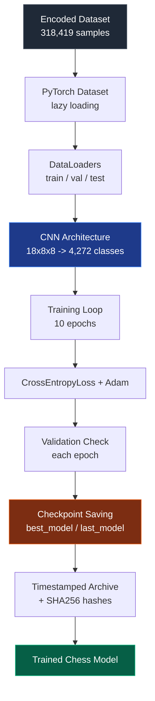
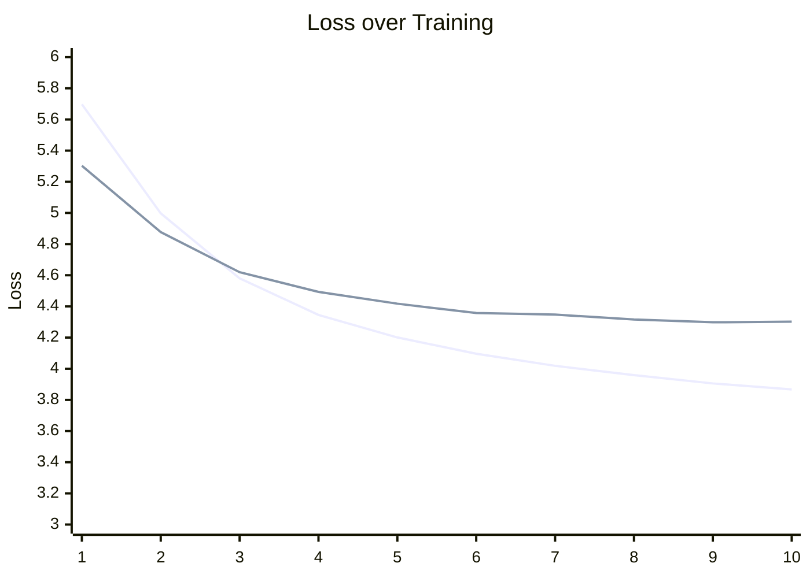

<div align="center">

# Supervised Chess AI — Dataset Pipeline

### Phase 3 · Neural Network Training Pipeline

*From encoded chess positions to a trained convolutional neural network that predicts moves from board positions.*


</div>

---

## Table of Contents

1. [Status](#status)
2. [Objectives](#objectives)
3. [Environment](#environment)
4. [Pipeline at a Glance](#pipeline-at-a-glance)
5. [Dataset Pipeline](#dataset-pipeline)
6. [Neural Network Architecture](#neural-network-architecture)
7. [Training Configuration](#training-configuration)
8. [Training Results](#training-results)
9. [Training Analysis](#training-analysis)
10. [Model Performance](#model-performance)
11. [Checkpoint Verification](#checkpoint-verification)
12. [Archive](#archive)
13. [Runtime Verification](#runtime-verification)
14. [Warnings Observed](#warnings-observed)
15. [Overfitting Analysis](#overfitting-analysis)
16. [Phase Verification Checklist](#phase-verification-checklist)
17. [Conclusion](#conclusion)

---

## Status

**Status: Completed**

Phase 3 implemented and verified the complete supervised-learning training pipeline for the chess AI. The project progressed from encoded chess positions to a fully trained convolutional neural network capable of predicting chess moves from board positions.

---

## Objectives

| # | Objective | Result |
|---|---|---|
| 1 | Build a PyTorch `Dataset` for on-demand sample loading | Done |
| 2 | Create `DataLoader`s for training, validation, and testing | Done |
| 3 | Design and implement the CNN architecture | Done |
| 4 | Train the model using supervised learning | Done |
| 5 | Validate learning performance | Done |
| 6 | Implement checkpoint saving | Done |
| 7 | Archive trained models safely | Done |
| 8 | Verify reproducibility | Done |

All objectives were successfully completed.

---

## Environment

**Hardware**

| Component | Spec |
|---|---|
| CPU | Intel Core i5-12450HX |
| GPU | NVIDIA GeForce RTX 2050 |
| System RAM | 12 GB |

**Software**

| Component | Version |
|---|---|
| Python | — |
| PyTorch | 2.5.1+cu121 |
| CUDA | 12.1 |
| python-chess | — |

**CUDA verification**

```text
CUDA Available: True
GPU Detected Successfully
CUDA Forward Pass Verified
```

---

## Pipeline at a Glance



---

## Dataset Pipeline

The previously generated encoded samples were loaded using a custom PyTorch `Dataset`.

| Split | Samples |
|---|---:|
| Training | 254,890 |
| Validation | 32,085 |
| Test | 31,444 |
| **Total** | **318,419** |

**Loading strategy**

- Lazy loading (on-demand encoding)
- Entire dataset never loaded into RAM
- Memory efficient

**DataLoader configuration**

| Parameter | Value |
|---|---|
| Batch Size | 32 |
| Shuffle | Training only |
| `num_workers` | 0 |
| `pin_memory` | Enabled (CUDA) |

---

## Neural Network Architecture

| Property | Value |
|---|---|
| Input shape | `(18, 8, 8)` |
| Output | 4,272 move classes |
| Trainable parameters | 751,248 |

**Architecture**

- Convolution layers
- ReLU activation
- Fully connected classifier
- Raw logits (no Softmax)

**Forward-pass verification**

| Device | Result |
|---|---|
| CPU | Passed |
| CUDA | Passed |

---

## Training Configuration

| Setting | Value |
|---|---|
| Loss function | CrossEntropyLoss |
| Optimizer | Adam |
| Device | CUDA (RTX 2050) |
| Training epochs | 10 |

**Checkpoint strategy**

- Save `best_model.pth` whenever validation loss improves.
- Save `last_model.pth` after the final epoch.

---

## Training Results

**Total training time:** 13,598.66 seconds (approximately 3 hours 46 minutes 39 seconds)

| Epoch | Train Loss | Validation Loss | Train Accuracy | Validation Accuracy |
|---:|---:|---:|---:|---:|
| 1 | 5.6974 | 5.3031 | 7.82% | 10.91% |
| 2 | 4.9975 | 4.8769 | 12.50% | 13.26% |
| 3 | 4.5805 | 4.6194 | 15.50% | 16.34% |
| 4 | 4.3454 | 4.4934 | 17.50% | 17.18% |
| 5 | 4.2009 | 4.4175 | 18.71% | 18.06% |
| 6 | 4.0962 | 4.3576 | 19.49% | 18.73% |
| 7 | 4.0189 | 4.3477 | 20.16% | 18.59% |
| 8 | 3.9589 | 4.3158 | 20.66% | 18.63% |
| 9 | 3.9056 | 4.2981 | 21.06% | 19.04% |
| 10 | 3.8672 | 4.3020 | 21.30% | 19.58% |



---

## Training Analysis

**Loss**

Training loss decreased smoothly throughout all epochs:

- Initial: 5.6974
- Final: 3.8672

Validation loss also consistently improved:

- Initial: 5.3031
- Best: 4.2981

This indicates stable optimization and successful learning.

**Accuracy**

| Metric | Start | End |
|---|---:|---:|
| Training accuracy | 7.82% | 21.30% |
| Validation accuracy | 10.91% | 19.58% |

Validation accuracy nearly doubled during training.

---

## Model Performance

**Best validation loss**

| Field | Value |
|---|---|
| Epoch | 9 |
| Validation loss | 4.2981 |
| Stored in | `models/best_model.pth` |

**Final model**

| Field | Value |
|---|---|
| Epoch | 10 |
| Validation accuracy | 19.58% |
| Stored in | `models/last_model.pth` |

---

## Checkpoint Verification

Both checkpoints were successfully verified.

**`best_model.pth`**

| Field | Value |
|---|---|
| Exists | Yes |
| Size | 9,030,050 bytes |

Stores:

- Model state
- Optimizer state
- Epoch
- Training loss
- Validation loss
- Training accuracy
- Validation accuracy

**`last_model.pth`**

| Field | Value |
|---|---|
| Exists | Yes |
| Size | 9,030,050 bytes |

Contains the final model after Epoch 10.

---

## Archive

A timestamped archive was created containing:

```text
best_model.pth
last_model.pth
training_summary.txt
checkpoint_info.txt
```

SHA256 hashes were generated for both checkpoints to ensure file integrity.

---

## Runtime Verification

Verified successfully:

- CUDA execution
- Dataset loading
- DataLoader batching
- Forward propagation
- Backpropagation
- Gradient updates
- Validation pipeline
- Checkpoint saving
- Training summary generation

---

## Warnings Observed

During training, `python-chess` produced several warnings regarding illegal SAN notation in a small number of PGN games.

```text
illegal san: 'd4'
illegal san: 'd1'
illegal san: 'f2'
```

**Analysis**

- These warnings originated from malformed PGN entries.
- Invalid games were skipped by the parser.
- Training continued normally.
- No effect on model convergence was observed.

---

## Overfitting Analysis

No significant signs of overfitting were detected.

| Metric | Value |
|---|---:|
| Training accuracy (final) | 21.30% |
| Validation accuracy (final) | 19.58% |
| Difference | Approximately 1.72 pp |

Training and validation losses remained closely aligned throughout all epochs.

---

## Phase Verification Checklist

<details>
<summary><strong>Click to expand full checklist</strong></summary>

- [x] CUDA verified
- [x] Dataset pipeline verified
- [x] DataLoader verified
- [x] CNN verified
- [x] Forward pass verified
- [x] Backpropagation verified
- [x] Adam optimizer verified
- [x] CrossEntropyLoss verified
- [x] 10 epochs completed
- [x] Validation pipeline verified
- [x] Best checkpoint saved
- [x] Final checkpoint saved
- [x] Archive created
- [x] SHA256 hashes generated
- [x] Training converged successfully

</details>

---

## Conclusion

Phase 3 successfully established a complete supervised-learning training pipeline for the chess AI. The convolutional neural network was trained on 318,419 encoded chess positions, achieving continuous reductions in both training and validation loss while improving prediction accuracy over ten epochs.