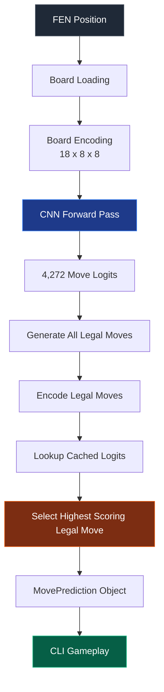
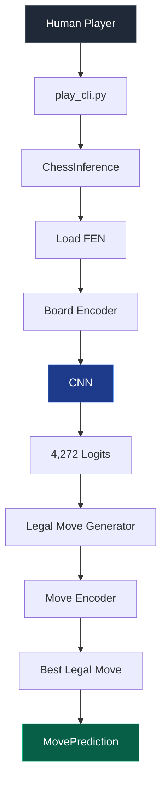

<div align="center">

# Supervised Chess AI — Dataset Pipeline

### Phase 4 · Inference and Gameplay System

*Turning the trained CNN into a real-time, legal-move-guaranteed chess-playing engine.*


</div>

---

## Table of Contents

1. [Objective](#objective)
2. [Phase Overview](#phase-overview)
3. [Phase Objectives](#phase-objectives)
4. [Step 1 — Model Loading](#step-1--model-loading)
5. [Step 2 — Board Loading](#step-2--board-loading)
6. [Step 3 — Board Encoding](#step-3--board-encoding)
7. [Step 4 — Neural Network Inference](#step-4--neural-network-inference)
8. [Step 5 — Move Decoder](#step-5--move-decoder)
9. [Step 6 — Legal Move Filtering](#step-6--legal-move-filtering)
10. [Step 7 — Unified AI Prediction API](#step-7--unified-ai-prediction-api)
11. [MovePrediction Data Structure](#moveprediction-data-structure)
12. [Step 8 — Command-Line Gameplay](#step-8--command-line-gameplay)
13. [Performance Evaluation](#performance-evaluation)
14. [Software Architecture](#software-architecture)
15. [Verification Summary](#verification-summary)
16. [Files Created](#files-created)
17. [Phase Achievements](#phase-achievements)
18. [Challenges Faced](#challenges-faced)
19. [Outcome](#outcome)
20. [Conclusion](#conclusion)

---

## Objective

The objective of Phase 4 was to transform the trained convolutional neural network from Phase 3 into a fully functional chess-playing engine. This phase focused on developing the complete inference pipeline, decoding model predictions into chess moves, enforcing chess legality, and enabling interactive gameplay through a command-line interface.

Unlike the previous phase, which concentrated on model training, Phase 4 emphasizes **deployment** of the trained model for real-time decision making.

---

## Phase Overview



This pipeline converts a chess position into a legal move predicted by the trained neural network.

---

## Phase Objectives

| # | Objective | Result |
|---|---|---|
| 1 | Load the trained CNN model | Done |
| 2 | Parse chess positions using FEN notation | Done |
| 3 | Encode board states into neural network input tensors | Done |
| 4 | Execute CNN inference | Done |
| 5 | Decode predicted move classes | Done |
| 6 | Filter illegal moves | Done |
| 7 | Select the highest scoring legal move | Done |
| 8 | Build a reusable prediction API | Done |
| 9 | Develop a command-line chess application | Done |

All objectives were successfully completed.

---

## Step 1 — Model Loading

A dedicated inference module was created to load the trained CNN.

**Features**

- Automatic CUDA detection
- CPU fallback support
- Checkpoint loading
- Model restoration
- Evaluation mode (`model.eval()`)
- Disabled gradient computation

**Checkpoint used:** `best_model.pth`

The checkpoint corresponds to the best validation loss obtained during Phase 3.

---

## Step 2 — Board Loading

Board states are loaded using `python-chess`.

**Features**

- Valid FEN parsing
- Invalid FEN detection
- Board visualization
- Side-to-move identification
- Castling rights display
- En passant tracking
- Halfmove clock
- Fullmove counter

**Test positions**

| Position |
|---|
| Initial Position |
| Midgame |
| Endgame |
| Promotion Position |
| Checkmate Position |

All positions loaded successfully.

---

## Step 3 — Board Encoding

The existing board encoder from Phase 3 was reused without modification. Each chess position is converted into the tensor format expected by the CNN.

| Property | Value |
|---|---|
| Encoded shape | `(18, 8, 8)` |
| Tensor shape (batched) | `(1, 18, 8, 8)` |
| Data type | `torch.float32` |
| Device | CUDA |

The encoding remains identical to the representation used during model training.

---

## Step 4 — Neural Network Inference

The encoded tensor is passed through the trained CNN.

**Features**

- `torch.no_grad()`
- Forward propagation
- Cached logits
- GPU inference

| Direction | Shape |
|---|---|
| Input | `(1, 18, 8, 8)` |
| Output | `(1, 4272)` |

The output consists of 4,272 logits corresponding to all supported move classes. No Softmax operation was applied, since only relative scores are required for move selection.

---

## Step 5 — Move Decoder

Raw class predictions produced by the CNN were decoded back into standard UCI chess moves.

```text
Class ID: 796  →  Move: e2e4
```

The decoder reused the existing move encoding system developed earlier.

**Verification**

Top-10 predictions were successfully decoded for:

| Position | Result |
|---|---|
| Initial Position | Passed |
| Midgame | Passed |
| Endgame | Passed |
| Promotion | Passed |
| Checkmate | Passed |

All decoded moves followed valid UCI notation.

---

## Step 6 — Legal Move Filtering

Neural networks may predict illegal chess moves. Instead of selecting the highest predicted class directly, every legal move generated by `python-chess` was evaluated.


This guarantees that every move returned by the AI is legal.

**Terminal positions**

If no legal moves exist:

- Checkmate detected
- Stalemate detected
- Graceful termination
- No crashes

---

## Step 7 — Unified AI Prediction API

A public inference interface was implemented:

```text
predict_best_move(fen)
```

This function performs the complete inference pipeline automatically.

**Internal pipeline**

```text
Load Board → Encode Board → CNN Inference → Generate Legal Moves → Score Legal Moves → Return Best Move
```

The returned result is stored in a structured `MovePrediction` object.

---

## MovePrediction Data Structure

To improve software design, tuples were replaced with a dedicated data structure.

**Stored information**

| Field |
|---|
| Chess Move |
| UCI String |
| Class ID |
| Logit Score |
| Legality Flag |

This design improves readability, maintainability, and future extensibility.

---

## Step 8 — Command-Line Gameplay

A standalone CLI application was implemented.

**File:** `Main/src/play_cli.py`

**Features**

- Human vs AI gameplay
- White or Black selection
- UCI move input
- Illegal move rejection
- Invalid syntax handling
- Board display after every move
- Move history
- Game-over detection

**Supported end conditions**

| End Condition |
|---|
| Checkmate |
| Stalemate |
| Threefold repetition |
| Fifty-move rule |
| Insufficient material |

---

## Performance Evaluation

Prediction timing was measured for every stage of inference.

| Stage | Average Time |
|---|---:|
| Board Loading | ~0.06 ms |
| Board Encoding | ~0.40 ms |
| CNN Inference | ~1.30 ms |
| Legal Move Selection | ~0.35 ms |
| **Total Prediction Time** | **~2.00 ms** |

The inference pipeline performs real-time move prediction suitable for interactive gameplay.

---

## Software Architecture



The system follows a modular architecture where each component performs a single responsibility.

---

## Verification Summary

The inference engine was verified using five representative chess positions.

| Test Position | Status |
|---|---|
| Initial Position | Passed |
| Midgame | Passed |
| Endgame | Passed |
| Promotion Position | Passed |
| Checkmate Position | Passed |

**Additional verification**

| Check | Result |
|---|---|
| Invalid FEN handling | Passed |
| Invalid UCI move detection | Passed |
| Illegal move rejection | Passed |
| Checkmate handling | Passed |
| Graceful program termination | Passed |
| Automated CLI testing | Passed |

---

## Files Created

```text
Main/src/inference.py
Main/src/play_cli.py
step_4_verification_report.md
step_5_verification_report.md
step_6_verification_report.md
step_7_verification_report.md
step_8_verification_report.md
```

---

## Phase Achievements

<details>
<summary><strong>Click to expand full checklist</strong></summary>

- [x] CNN model loading
- [x] Board parsing
- [x] Board encoding
- [x] Neural network inference
- [x] Move decoding
- [x] Legal move filtering
- [x] Unified prediction API
- [x] MovePrediction abstraction
- [x] Command-line gameplay
- [x] Performance profiling
- [x] Automated verification

</details>

---

## Challenges Faced

| Challenge |
|---|
| Maintaining identical board encoding between training and inference |
| Efficiently mapping legal moves back to their corresponding neural network outputs |
| Preventing redundant CNN forward passes |
| Handling terminal game states without errors |
| Designing a reusable inference API suitable for future GUI and web integration |
| Ensuring robust user input validation in the CLI |

---

## Outcome

Phase 4 successfully transformed the supervised CNN model into a fully operational chess-playing engine. The completed system loads trained weights, interprets chess positions, predicts moves using deep learning, guarantees move legality through rule-based filtering, and enables full human-versus-AI gameplay through a command-line interface. The modular design also provides a reusable inference API that can support future graphical interfaces, web applications, reinforcement learning, and stronger search algorithms.

---

## Conclusion

Phase 4 marks the transition from model development to real-world deployment. The chess AI is now capable of making legal moves in real time with an average prediction latency of approximately 2 milliseconds. Through robust validation, modular software architecture, and efficient inference, this phase establishes a solid foundation for future enhancements such as automated benchmarking, Stockfish evaluation, graphical user interfaces, reinforcement learning, and search-based improvements. The project has successfully evolved into a functional, playable supervised chess AI.