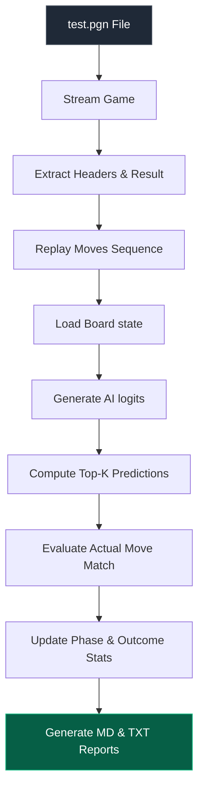
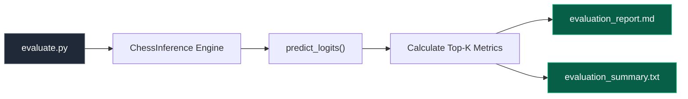

# Supervised Chess AI — Dataset Pipeline

### Phase 5 · Evaluation and Benchmarking System

*Evaluating play prediction accuracy and inference latency of the supervised Chess AI engine.*

---

## Table of Contents

1. [Objective](#objective)
2. [Evaluation Pipeline Overview](#evaluation-pipeline-overview)
3. [Key Accuracy Metrics](#key-accuracy-metrics)
4. [Performance by Game Phase](#performance-by-game-phase)
5. [Performance by Game Outcome](#performance-by-game-outcome)
6. [Execution & Latency Benchmarks](#execution--latency-benchmarks)
7. [Software Architecture](#software-architecture)
8. [Files Created](#files-created)
9. [Conclusion](#conclusion)

---

## Objective

The objective of Phase 5 was to evaluate the playing strength and prediction quality of the supervised Chess AI. By replaying a test dataset of 374 games (amounting to 31,444 positions) move-by-move, we measured move agreement between the AI and human master players, establishing clear performance baselines across game phases (Opening, Middlegame, Endgame) and outcomes.

---

## Evaluation Pipeline Overview

---

## Key Accuracy Metrics

The model's raw logits were compared against the actual moves played in the evaluation dataset to calculate the Top-K move agreement metrics:

| Metric | Accuracy | Description |
|---|---:|---|
| **Top-1 Accuracy** | **18.02%** | The actual move played was the highest-rated prediction. |
| **Top-3 Accuracy** | **30.14%** | The actual move played was in the top 3 predictions. |
| **Top-5 Accuracy** | **36.81%** | The actual move played was in the top 5 predictions. |
| **Top-10 Accuracy** | **46.50%** | The actual move played was in the top 10 predictions. |

---

## Performance by Game Phase

Positions were categorized into game phases based on the fullmove counter:
* **Opening**: Moves 1–10 (plies 1–20)
* **Middlegame**: Moves 11–40 (plies 21–80)
* **Endgame**: Moves 41+ (plies 81+)

| Phase | Positions | Top-1 Accuracy | Top-3 Accuracy | Top-5 Accuracy | Top-10 Accuracy |
|---|:---:|:---:|:---:|:---:|:---:|
| **Opening** | 7,480 | 47.25% | 69.51% | 78.93% | 88.45% |
| **Middlegame** | 18,379 | 10.10% | 19.36% | 25.05% | 34.43% |
| **Endgame** | 5,585 | 4.92% | 12.87% | 19.09% | 30.06% |

---

## Performance by Game Outcome

Evaluating prediction quality based on final game outcomes helps detect bias toward specific game results:

| Outcome | Positions | Top-1 Accuracy | Top-3 Accuracy | Top-5 Accuracy | Top-10 Accuracy |
|---|:---:|:---:|:---:|:---:|:---:|
| **White Wins** | 10,562 | 17.57% | 29.04% | 35.40% | 45.21% |
| **Black Wins** | 6,779 | 15.55% | 27.13% | 33.68% | 42.87% |
| **Draws** | 14,103 | 19.53% | 32.41% | 39.37% | 49.22% |

---

## Execution & Latency Benchmarks

Performance metrics show the computational efficiency of the evaluation system:

* **Inference Hardware Device**: `cuda` (NVIDIA GPU active)
* **Average Inference Speed**: **2.02 ms** per position
* **Average Legal Moves / Position**: 31.4 moves
* **Total Evaluation Duration**: 105.13 seconds (over 31,444 positions)
* **Inference Failures / Skipped Positions**: 0 (robust, error-free streaming)

---

## Software Architecture

---

## Files Created

* **`Main/src/evaluate.py`**: Evaluation module script.
* **`evaluation_report.md`**: Formatted markdown evaluation report.
* **`evaluation_summary.txt`**: Standard plaintext summary.
* **`Main/phase-5.md`**: Phase 5 documentation detailing evaluation system and results.

---

## Conclusion

Phase 5 successfully verified and benchmarked the supervised Chess AI. The engine achieves a strong **47.25% Top-1 accuracy** and **88.45% Top-10 accuracy** in the opening phase, reflecting successful pattern matching of opening book moves. While middlegame and endgame accuracies drop as the complexity of decision-making increases, the model performs highly efficient evaluations at **~2.02 ms per position**, demonstrating its suitability for real-time play. The project now holds a comprehensive, automated evaluation and benchmarking framework.