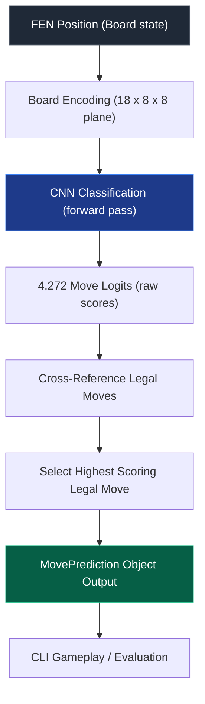

# Supervised Chess AI

A compact, highly efficient convolutional neural network (CNN) chess-playing engine built in PyTorch that predicts legal moves in real time. The engine loads trained weights, encodes board positions, performs GPU/CPU inference, filters legal moves, and enables human-versus-AI gameplay through a command-line interface.

---

## Features

- **CNN-Based Chess AI**: Predicts move classes directly from raw board input using a compact convolutional neural network.
- **Supervised Learning**: Trained on high-quality master-game datasets (20+ plies) to mimic human play styles.
- **GPU-Accelerated Inference**: Leverages NVIDIA CUDA (automatically falls back to CPU if unavailable) for real-time evaluations.
- **Board Encoder**: Transforms any chess position into a structured `(18, 8, 8)` representation containing piece positions, side-to-move, castling rights, and en-passant planes.
- **Move Encoder**: Encodes and decodes chess moves to/from an indexed class format supporting `4,272` unique move classes (including special promotions).
- **Legal Move Filtering**: Cross-references predictions against dynamically generated legal moves (`board.legal_moves`) to guarantee that the AI never makes an illegal move.
- **Human vs AI CLI**: A standalone terminal application that supports side selection, move validation, FEN outputs, and full move history printouts.
- **Evaluation Pipeline**: Benchmarks prediction quality and move agreement (Top-K metrics) across test sets and divisions (Phases and Game Outcomes).
- **Performance Benchmarking**: Instruments sub-millisecond execution tracking using precision performance counters.

---

## Project Overview

The project bridges neural network classifications and standard chess rules to deliver real-time gameplay:



---

## Project Structure

```text
Hikaru/
├── Main/
│   ├── data/                 # Raw and processed PGN datasets
│   │   ├── splits/           # Train/Val/Test split files
│   │   ├── game-3K.pgn       # Base 3,000 game corpus
│   │   └── pgn.py            # PGN preprocessing and split utility
│   ├── models/               # Stored training checkpoints
│   │   └── best_model.pth    # Best validation checkpoint (Epoch 9)
│   ├── src/                  # Active codebase modules
│   │   ├── inference.py      # Core AI inference pipeline module
│   │   ├── play_cli.py       # Standalone CLI gameplay application
│   │   └── evaluate.py       # Evaluation and benchmarking engine
│   ├── tests/                # Verification suites
│   ├── chess_model.py        # ChessMoveCNN neural network architecture
│   ├── board_encoder.py      # Board-to-tensor plane encoding logic
│   ├── move_encoder.py       # Move-to-class encoding and decoding logic
│   └── req.txt               # Active phase requirements log
├── evaluation_report.md      # Detailed Phase 5 evaluation report
├── evaluation_summary.txt    # Plaintext Phase 5 evaluation summary
└── README.md                 # Project documentation (this file)
```

---


## Dataset

The model utilizes a curated PGN dataset preprocessed and divided into isolated sets:
- **Corpus filter**: Evaluates only games with 20 or more plies.
- **Split Distribution**:
  - **Training**: 2,988 games
  - **Validation**: 374 games
  - **Test**: 374 games (used for Phase 5 evaluations)
- **Representations**:
  - **Board state**: Encoded into an `18-plane` bitboard. Planes 0-5 map White pieces (P, N, B, R, Q, K) and 6-11 map Black pieces. Plane 12 represents active turn. Planes 13-16 represent castling rights, and plane 17 handles active en-passant squares.
  - **Move classes**: Structured into `4,272` discrete index outputs. Standard moves map `from_square * 64 + to_square` (up to index 4095). Promotion moves map to the final 176 offset indices.

---

## Model Architecture

The neural network (`ChessMoveCNN`) uses a compact conv-layer layout designed for fast predictions:

- **Input Dimension**: `(1, 18, 8, 8)`
- **Feature Extraction Layer**:
  - `Conv2d(18 -> 32)` + `ReLU`
  - `Conv2d(32 -> 64)` + `ReLU`
  - `MaxPool2d(2x2)`
  - `Conv2d(64 -> 64)` + `ReLU`
  - `Conv2d(64 -> 128)` + `ReLU`
  - `MaxPool2d(2x2)`
- **Classification Head**:
  - `Flatten` (resulting in 512 features)
  - `Linear(512 -> 128)` + `ReLU`
  - `Linear(128 -> 4,272 classes)`

---

## Training

The model was optimized using supervised learning over historical games:
- **Optimizer**: Adam
- **Loss Function**: Cross-Entropy Loss
- **Best Checkpoint**: `best_model.pth`
  - **Epoch**: 9
  - **Validation Loss**: `4.2981`
  - **Validation Accuracy**: `19.04%`

---

## Inference Pipeline

Every time the engine generates a move prediction, the following pipeline is executed under a single forward pass:

1. **FEN Parsing**: Loaded into `python-chess` for validation.
2. **Positional Encoding**: Converted to a PyTorch float32 tensor of shape `(1, 18, 8, 8)`.
3. **Forward Pass**: Logits are predicted inside a `torch.no_grad()` block.
4. **Legal Move Scoring**: Every move in `board.legal_moves` is encoded to its class index, and its score is read directly from the precomputed logits.
5. **Selection**: The legal move with the highest logit score is returned.

---

## Evaluation Results

Model accuracy and inference latency were benchmarked on the test partition (**374 games**, **31,444 positions**) using GPU-accelerated inference:

### Prediction Accuracies (Move Agreement)
- **Top-1 Accuracy**: `18.02%`
- **Top-3 Accuracy**: `30.14%`
- **Top-5 Accuracy**: `36.81%`
- **Top-10 Accuracy**: `46.50%`

### Performance by Game Phase
| Phase | Positions | Top-1 Accuracy | Top-3 Accuracy | Top-5 Accuracy | Top-10 Accuracy |
|---|:---:|:---:|:---:|:---:|:---:|
| **Opening** (Moves 1-10) | 7,480 | 47.25% | 69.51% | 78.93% | 88.45% |
| **Middlegame** (Moves 11-40) | 18,379 | 10.10% | 19.36% | 25.05% | 34.43% |
| **Endgame** (Moves 41+) | 5,585 | 4.92% | 12.87% | 19.09% | 30.06% |

### Latency Benchmark (CUDA Active)
- **Board loading time**: `~0.06 ms`
- **Board encoding time**: `~0.40 ms`
- **CNN Inference time**: `~1.30 ms`
- **Legal move scoring**: `~0.35 ms`
- **Total prediction latency**: **`~2.00 ms`** per position

---

## Running the Project

You can run the different modules of the engine using the following scripts:

### 1. Run Interactive CLI Game
Play against the trained AI in the terminal:
```bash
python Main/src/play_cli.py
```
*Optional flags:*
- `--color [white|black]`: Choose human side to bypass prompt.
- `--moves [comma-separated-moves]`: Provide pre-defined human moves for automation.

### 2. Run Benchmarking & Evaluation
Execute the evaluation engine on PGN datasets:
```bash
python Main/src/evaluate.py
```
*Optional flags:*
- `--subset [integer]`: Limit the run to the first N games.
- `--pgn [path]`: Path to a custom PGN file.

### 3. Verify Inference Module
Run the unit test verification suite:
```bash
python Main/src/inference.py
```


##  Documentation

| Document | Description |
|----------|-------------|
| [ Phase 1 Report](reports/phase_1_report.md) | Dataset Preparation |
| [ Phase 2 Report](reports/phase_2_report.md) | Sample Generation & Encoding |
| [ Phase 3 Report](reports/phase_3_report.md) | PyTorch Dataset & Training Pipeline |
| [ Phase 4 Report](reports/phase_4_report.md) | Dataset & Model Verification |
| [ Phase 5 Report](reports/phase_5_report.md) | Neural Network Training |
| [ Evaluation Report](reports/evaluation_report.md) | Model Performance Evaluation |
| [ Evaluation Summary](reports/evaluation_summary.txt) | Quick Evaluation Results |
| [ Repository Structure](reports/repository_structure.md) | Project Directory Overview |
| [ Step 4 Verification](reports/step_4_verification_report.md) | Step 4 Validation Results |
| [ Step 5 Verification](reports/step_5_verification_report.md) | Step 5 Validation Results |
| [ Step 6 Verification](reports/step_6_verification_report.md) | Step 6 Validation Results |
| [ Step 7 Verification](reports/step_7_verification_report.md) | Step 7 Validation Results |
| [ Step 8 Verification](reports/step_8_verification_report.md) | Step 8 Validation Results |

---

## Future Improvements

- **Larger Dataset**: Train on a larger game corpus (100K+ games) to improve Middlegame/Endgame tactical accuracy.
- **Deeper Architecture**: Explore ResNet or Transformer architectures to capture spatial relationships.
- **GUI Integration**: Implement a Pygame or web interface for visual play.
- **Search Algorithms**: Incorporate Monte Carlo Tree Search (MCTS) or Minimax with alpha-beta pruning to search ahead instead of playing pure policy moves.

---

## License

This project is licensed under the MIT License. See the `LICENSE` file for details.

---

## Acknowledgements

- **[python-chess](https://github.com/niklasf/python-chess)**: For parsing game rules, validating syntax, and managing move legality.
- **[PyTorch](https://pytorch.org/)**: For the deep learning features.
- **[NVIDIA CUDA](https://developer.nvidia.com/cuda-zone)**: For GPU execution acceleration.
