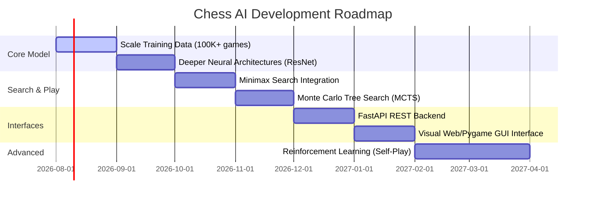

# Chess AI Project Roadmap

This document outlines the planned future milestones and feature enhancements for the Supervised Chess AI engine.

---

## Roadmap Overview

---

## 1. Core Model Enhancements

### Scale Dataset Size
* **Goal**: Increase the training data from the current 3,000 games to over 200,000 games.
* **Details**: Download and parse raw PGN dump files from the Lichess open-source database. Filter games based on Elo ratings (>2000) and game ply counts (>20 plies) to extract millions of high-quality training positions.

### Deeper Neural Architectures
* **Goal**: Replace the compact `ChessMoveCNN` with deeper networks to improve prediction accuracies in complex positions.
* **Details**: Implement residual learning connections (ResNet-18/34 blocks) and spatial attention modules. Test accuracy gains and monitor inference latency to maintain real-time performance.

---

## 2. Lookahead Search Integration

### Minimax with Alpha-Beta Pruning
* **Goal**: Integrate depth search to check ahead multiple moves.
* **Details**: Combine the CNN's classification policy logits with a standard Minimax search algorithm. Use policy scores to prune weak moves early (move ordering), focusing the search tree only on promising variations.

### Monte Carlo Tree Search (MCTS)
* **Goal**: Implement a search framework similar to AlphaGo/AlphaZero.
* **Details**: Combine the policy model with rollouts and tree selection, guiding exploration based on neural network outputs.

---

## 3. Interfaces & Deployments

### REST API Service
* **Goal**: Host the Chess AI as a microservice.
* **Details**: Build a fast, lightweight FastAPI server. Provide endpoint structures (`/predict`) accepting FEN strings and returning `MovePrediction` objects in JSON format.

### Graphical User Interface (GUI)
* **Goal**: Develop a visual chessboard application.
* **Details**: Create a Pygame or Electron-based desktop chessboard where players can play using drag-and-drop piece interactions instead of terminal UCI input.

---

## 4. Advanced Training Methods

### Stockfish Engine Benchmarking
* **Goal**: Match the AI against Stockfish to measure Elo playing strength.
* **Details**: Implement automated matches against Stockfish at varying search depths (e.g. Depth 1 to 10) to benchmark playing capabilities.

### Reinforcement Learning (RL) via Self-Play
* **Goal**: Train the model to improve itself without human supervision.
* **Details**: Utilize policy gradients (PPO or REINFORCE) inside a self-play simulator. The model plays games against previous checkpoints, learning from wins/losses to discover new tactical strategies.
