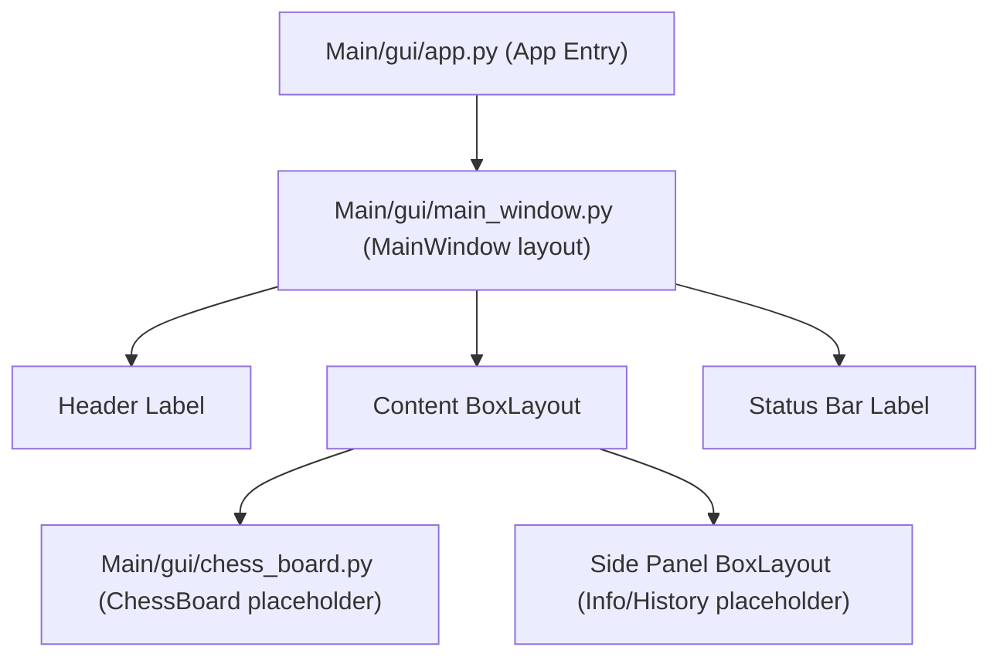

# Phase 7 – Step 1 Verification Report

This report documents the verification and layout details of the Kivy-based GUI foundation for the Supervised Chess AI.

---

## 📁 GUI Folder Tree

The Kivy GUI framework has been established with the following modular directory and file layout under [Main/gui/](file:///c:/BRAIN-STORM/chess-game-app/Hikaru/Main/gui):

```text
Main/gui/
├── app.py                     # Entry point, Kivy App definition
├── main_window.py             # Root vertical layout (MainWindow)
├── chess_board.py             # Chess Board widget placeholder
│
├── assets/                    # Static assets for graphics
│   ├── pieces/                # Chess pieces images (placeholder)
│   ├── boards/                # Board theme images (placeholder)
│   └── icons/                 # UI icons (placeholder)
│
├── screens/                   # Screen classes for future navigation
├── widgets/                   # Custom UI components
├── themes/                    # Graphical style and theme definitions
└── utils/                     # Helper utilities for UI math/coordinate mappings
```

---

## 🛠️ Files Created

1. **[Main/gui/app.py](file:///c:/BRAIN-STORM/chess-game-app/Hikaru/Main/gui/app.py)**: Loads Kivy config rules, configures window size (`900x650`, resizable), and launches the `SupervisedChessAIApp` binding `MainWindow` as the application root.
2. **[Main/gui/main_window.py](file:///c:/BRAIN-STORM/chess-game-app/Hikaru/Main/gui/main_window.py)**: Defines the vertical `BoxLayout` layout consisting of acentered professional Header, a horizontal content splits section (ChessBoard area + Side Panel), and a status bar indicating `"Status: Ready"`.
3. **[Main/gui/chess_board.py](file:///c:/BRAIN-STORM/chess-game-app/Hikaru/Main/gui/chess_board.py)**: Defines the standalone Kivy `ChessBoard` widget with a centered placeholder Label showing `"Chessboard Coming Soon"`.
4. **Placeholder `.gitkeep` files**: Created to preserve the empty asset and code directories in Git version control.

---

## 📐 Architecture Summary

The GUI acts purely as a presentation layer, ensuring separation of concerns:



AI reasoning, training, and move generation functions remain completely isolated inside the `src/` modules, ensuring that the GUI contains no ML inference logic.

---

## 📋 Verification Checklist

- [x] **Framework Setup**: Kivy GUI directory structure successfully created.
- [x] **Kivy App Entry**: Title correctly configured as `"Supervised Chess AI"`.
- [x] **Header Verification**: Professional centered header title implemented.
- [x] **Board Area Reservation**: Standalone `ChessBoard` widget created displaying `"Chessboard Coming Soon"`.
- [x] **Side Panel Layout**: Reserved space for move logs, evaluation, settings, and model statistics.
- [x] **Status Bar**: Implemented displaying `"Status: Ready"`.
- [x] **Code Quality**: Clean object-oriented design with individual widget files.

---

## ⚠️ Known Limitations & Setup Instructions

Kivy is not pre-installed in the python virtual environment. 

### 🔧 Installation Command:
To run the GUI application locally, Kivy must be installed in the virtual environment using:
```bash
.venv\Scripts\pip.exe install kivy
```

Once Kivy is installed, the GUI application can be launched using:
```bash
.venv\Scripts\python.exe Main/gui/app.py
```
*(No model inference is loaded, no squares or pieces are rendered, and no gameplay is implemented in this step, per constraints).*
