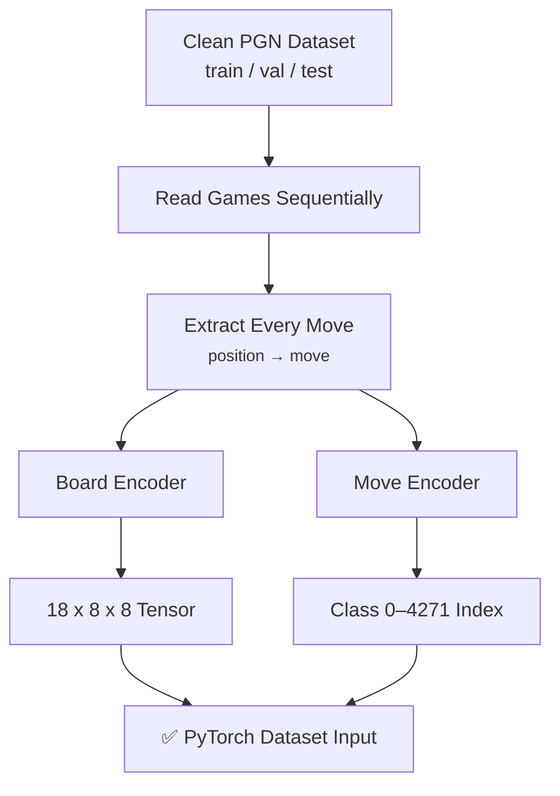

<div align="center">

# Supervised Chess AI — Dataset Pipeline

### Phase 2 · Supervised Learning Sample Generation & Encoding (Updated)

*Turning verified PGN datasets into numerical board and move representations for training.*


</div>

---

## Table of Contents

1. [Overview](#overview)
2. [Pipeline at a Glance](#pipeline-at-a-glance)
3. [Position → Move Sample Extraction](#1-position--move-sample-extraction)
4. [Full Dataset Sample Count](#2-full-dataset-sample-count)
5. [Board Encoding](#3-board-encoding)
6. [Final Board Representation](#4-final-board-representation)
7. [Move Encoding](#5-move-encoding)
8. [Dataset Encoding Verification](#6-dataset-encoding-verification)
9. [Verification Results](#7-verification-results)
10. [Pipeline Summary](#8-pipeline-summary)

---

## Overview

Phase 2 transforms the cleaned and split PGN chess dataset from Phase 1 into numerical representations suitable for supervised machine learning.

Phase 1 produced three verified PGN datasets:

| Dataset | Games |
|---|---:|
| Training | 4,837 |
| Validation | 604 |
| Test | 606 |
| **Total** | **6,047** |

Phase 2 converts these games into supervised-learning examples:

```text
Current Chess Position → Next Move
```

Two encoding systems are built and verified:
1. **Board Encoder** — converts a chess position into an `(18, 8, 8)` numerical representation.
2. **Move Encoder** — converts the target move into one of `4,272` unique move classes.

---

## Pipeline at a Glance



---

## 1. Position → Move Sample Extraction

Each PGN game contains the starting position and a list of moves. The pipeline traverses each game from start to finish, generating one training sample per ply:
- **Input**: The board state immediately *before* a move.
- **Target**: The move played in the game.

For a game of $M$ moves, we extract exactly $M$ training samples.

---

## 2. Full Dataset Sample Count

A complete count of position-to-move samples across all split sets was performed:

| Split Set | Games | Extracted Samples (Plies) | Share |
|---|---:|---:|---:|
| 🟩 Training | 4,837 | **423,469** | 79.73% |
| 🟨 Validation | 604 | **53,613** | 10.09% |
| 🟦 Testing | 606 | **54,041** | 10.18% |
| **Combined** | **6,047** | **531,123** | **100%** |

---

## 3. Board Encoding

To represent a chess board as a tensor, we construct an `18-plane` bitboard representation of shape `(18, 8, 8)`:
- **Planes 0-5**: Active turn player's pieces (P, N, B, R, Q, K).
- **Planes 6-11**: Opponent's pieces (p, n, b, r, q, k).
- **Plane 12**: Side to move (All 1s if White's turn, All 0s if Black's turn).
- **Planes 13-16**: Castling rights (King-side and Queen-side castling rights for both players).
- **Plane 17**: Active en-passant square target (if applicable).

---

## 4. Final Board Representation

The resulting tensor representation has dimensions:
- **Shape**: `(18, 8, 8)`
- **Data type**: Float32 (compatible with neural networks)
- **Values**: Binary values $\{0.0, 1.0\}$ indicating presence or state.

---

## 5. Move Encoding

Standard chess moves are encoded to a unique index using a mapping of **4,272** distinct move classes:
- **Standard Moves (0 to 4,095)**: Source square $(0..63)$ and target square $(0..63)$. Calculated as `from_square * 64 + to_square`.
- **Special Promotion Moves (4,096 to 4,271)**: Captures promotion moves (Knight, Bishop, Rook, Queen) with corresponding offsets.

---

## 6. Dataset Encoding Verification

An automated script verified the correctness of board and move encodings for every single ply of the dataset:
- Checked shape = `(18, 8, 8)`
- Checked move class in range `0 <= class < 4272`
- Checked round-trip encoding/decoding consistency

---

## 7. Verification Results

Running the verification on all splits produced the following output:

```text
[train.pgn] samples=423469 board_shape_failures=0 move_class_failures=0 round_trip_failures=0
[validation.pgn] samples=53613 board_shape_failures=0 move_class_failures=0 round_trip_failures=0
[test.pgn] samples=54041 board_shape_failures=0 move_class_failures=0 round_trip_failures=0
[combined] samples=531123 board_shape_failures=0 move_class_failures=0 round_trip_failures=0
```

- **Shape failures**: `0`
- **Class limit violations**: `0`
- **Round-trip failures**: `0`

✅ Encoding pipeline is 100% verified.

---

## 8. Pipeline Summary

- [x] Extracted **531,123 samples** from 6,047 games.
- [x] Implemented board encoding with `(18, 8, 8)` tensors.
- [x] Mapped moves to **4,272 classes** (including promotions).
- [x] Run full dataset encoding verification checks.
- [x] Passed 100% of round-trip validation tests.
